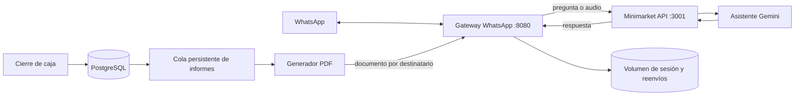

# Servicios de minimarket y WhatsApp

El repositorio contiene dos procesos. Solo el gateway mantiene la sesión de WhatsApp.



## Minimarket

Comando:

```sh
npm --workspace @minisuper/backend run start
```

Responsabilidades:

- API del punto de venta, Prisma y PostgreSQL.
- Consultas del asistente, Gemini y memoria de conversaciones.
- Programación, PDF, persistencia y reintentos de informes.
- Cliente HTTP del gateway; no abre una sesión de WhatsApp.

Variables relacionadas:

```text
DATABASE_URL=...
GEMINI_API_KEY=...
INFORME_INTERNO_SECRET=<misma clave en ambos servicios>
WHATSAPP_BOT_URL=http://asistente-de-inventario.railway.internal:8080
WHATSAPP_NUMERO_AUTORIZADO=504XXXXXXXX@s.whatsapp.net
WHATSAPP_NUMEROS_INFORME_ADICIONALES=504YYYYYYYY@s.whatsapp.net
```

La descarga de emergencia del PDF ahora pertenece a minimarket:
`/interno/informe-turno-pdf?turno=C&fecha=AAAA-MM-DD&turnoCajaId=ID&clave=...`.

## Gateway WhatsApp

Comando recomendado:

```sh
npm --workspace @minisuper/backend run gateway:whatsapp
```

El comando anterior `bot:whatsapp` sigue apuntando al mismo proceso para permitir una transición sin romper Railway.

Responsabilidades:

- Vinculación por código o QR en `/pair`.
- Una sola sesión y un solo socket de WhatsApp.
- Recepción de mensajes y traslado de preguntas a minimarket.
- Envío ordenado de textos y documentos por `/interno/enviar`.
- Almacén persistente de mensajes para solicitudes de reenvío de WhatsApp.

Variables relacionadas:

```text
PORT=8080
WHATSAPP_SESSION_DIR=/data/whatsapp-session
WHATSAPP_NUMERO_AUTORIZADO=504XXXXXXXX@s.whatsapp.net
QR_PAGE_SECRET=...
INFORME_INTERNO_SECRET=<misma clave en ambos servicios>
MINIMARKET_API_URL=http://minimarket24-7.railway.internal:3001
WHATSAPP_LOG_LEVEL=warn
```

El gateway ya no necesita `DATABASE_URL`, `GEMINI_API_KEY` ni los destinatarios adicionales. Railway puede conservar variables sobrantes, pero el código no las lee.

## Orden de despliegue

1. Subir el commit.
2. Desplegar primero minimarket.
3. Configurar `MINIMARKET_API_URL` en el servicio del gateway.
4. Cambiar su comando de inicio a `npm --workspace @minisuper/backend run gateway:whatsapp`.
5. Desplegar el gateway.
6. Consultar `/pair` y confirmar `conectado`.

No hay migraciones ni dependencias nuevas. Los informes permanecen en PostgreSQL durante la transición y se reintentan cuando ambos servicios estén disponibles. No borrar el volumen ni cambiar `WHATSAPP_SESSION_DIR` durante el despliegue.

Un 401 sigue significando que WhatsApp rechazó la sesión. La separación evita que fallos de Gemini, PDF o Prisma derriben el socket, pero no convierte en válida una sesión que WhatsApp ya cerró. Conservar `codigo`, `etapa` y `detalles` del diagnóstico.

## Recuperar una sesión rechazada con 401

Este procedimiento solo aplica cuando `/pair` ya muestra una desconexión 401. Es el paso final, después de desplegar y validar los dos servicios:

1. Detener temporalmente el gateway para que ningún proceso escriba credenciales mientras se recupera la sesión.
2. En el teléfono o tablet que conserva la cuenta principal, abrir **WhatsApp > Dispositivos vinculados** y cerrar las sesiones antiguas del bot. No cerrar la cuenta principal.
3. Cambiar únicamente en el gateway `WHATSAPP_SESSION_DIR` a una ruta nueva que nunca se haya usado, por ejemplo `/data/whatsapp-session-v2`. Esto deja aisladas las credenciales rechazadas sin borrar el volumen.
4. Volver a desplegar el gateway, abrir `/pair` y solicitar un único código para el número emisor, sin `+`, espacios ni guiones.
5. Introducir ese código en **Vincular con número de teléfono** y luego consultar el estado. No generar otro código durante ese intento.

La página conserva el mismo código durante toda la conexión. Para comenzar otro intento debe iniciarse un socket nuevo con una carpeta de sesión limpia. Si una sesión completamente nueva también termina en `401` y `location=lla`, guardar ese diagnóstico: el rechazo ya ocurre en los servidores de WhatsApp durante la vinculación y no se corrige con más reintentos sobre el mismo socket.

## Verificación

Las pruebas cubren sesión, QR tardíos, reconexión, cola de envíos, API interna, asistente remoto, documentos e informes persistentes. Usan dobles locales: no vinculan teléfonos ni envían mensajes reales.
